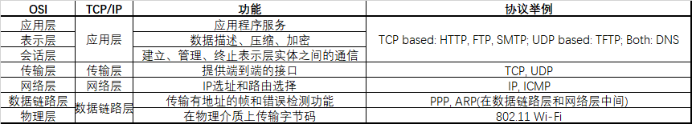

# 分别说一下OSI和TCP/IP协议模型？

## OSI和TCP/IP协议模型对比

## Reference

1. [前端面试小本本](https://barryyeee.github.io/InterviewGuide/Chapter2/%E8%AE%A1%E7%AE%97%E6%9C%BA%E7%BD%91%E7%BB%9C/%E7%BD%91%E7%BB%9C%E6%A8%A1%E5%9E%8B%E5%92%8C%E7%BD%91%E7%BB%9C%E5%8D%8F%E8%AE%AE.html)
2. [【牛客网】前端面试宝典](https://www.nowcoder.com/tutorial/96/4e90227047534233a54e3ea32951b172)
3. [List of network protocols \(OSI model\)](https://en.wikipedia.org/wiki/List_of_network_protocols_%28OSI_model%29)

