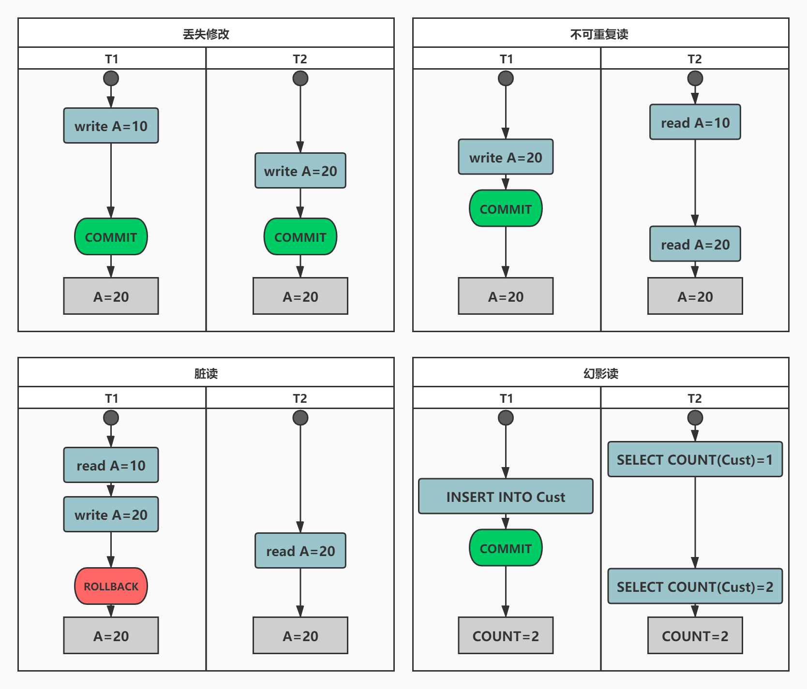

# 并发一致性问题？

## 并发一致性1+3种问题

除丢失修改以外，脏读、不可重复读和幻影读可通过修改隔离级别解决。

### 丢失修改

丢失修改指一个事务的更新操作被另外一个事务的更新操作替换。如：T1 和 T2 两个事务都对一个数据进行修改，T1 先修改并提交生效，T2 随后修改，T2 的修改覆盖了 T1 的修改。

### 脏读

读脏数据指在不同的事务下，当前事务可以读到另外事务未提交的数据。例如：T1 修改一个数据但未提交，T2 随后读取这个数据。如果 T1 撤销了这次修改，那么 T2 读取的数据是脏数据。指在不同的事务下，当前事务可以读到另外事务未提交的数据。例如：T1 修改一个数据但未提交，T2 随后读取这个数据。如果 T1 撤销了这次修改，那么 T2 读取的数据是脏数据。

### 不可重复读

不可重复读指在一个事务内多次读取同一数据行发生不一致。这一事务读取一行后还未结束，另一事务也访问了同一数据行，做了修改并且提交。第一次事务先后两次读取的数据行内容不一致。例如：T2 读取一个数据，T1 对该数据做了修改并提交，T2 再次读取这个数据，此时读取的结果和第一次读取的结果不同。

### 幻影读

幻读本质上也属于不可重复读的情况，T1 读取某个范围的数据，T2 在这个范围内插入新的数据，T1 再次读取这个范围的数据，此时读取的结果和和第一次读取的结果不同。

可以说不可重复读针对的是某些具体数据行，涉及到的操作是UPDATE；幻读针对的是一个范围，涉及到的操作是 INSERTS 和/或 DELETES，以及聚合函数（如SUM或者COUNT等）。

## Reference

1. [https://stackoverflow.com/questions/11043712/what-is-the-difference-between-non-repeatable-read-and-phantom-read](https://stackoverflow.com/questions/11043712/what-is-the-difference-between-non-repeatable-read-and-phantom-read) 

