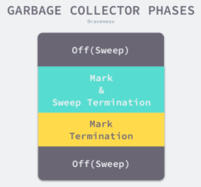

# GC过程？

## 垃圾回收过程的四个阶段

### 清理终止阶段

1. 触发Stop The World以暂停程序，所有的处理器P进入安全点（safe-point）；
2. 清理仍未被清理的span。

### 标记阶段

1. GC 状态由`_GCoff`改成`_GCmark`，开启写屏障和Mutator Assists（用户程序协助线程），将根对象入队；
2. 恢复程序执行，Mark Workers（标记进程）和 Mutator Assists（协助线程）会开始并发标记内存中的对象。任何指针覆盖和新的指针值都会被写屏障覆盖并标记成灰色，而所有新创建的对象都会被直接标记成黑色；
3. 扫描根对象，包括所有 Goroutine 的栈、全局对象以及不在堆中的运行时数据结构。扫描Goroutine时会暂停处理器P，把扫描到的对象变灰色，扫描结束恢复Goroutine；
4. GC 在遍历灰色对象队列时，会将灰色对象变黑色，并将该对象指向的对象置灰；
5. 使用分布式的终止算法，检查何时不再有根标记作业或灰色对象，发现标记阶段完成后进入标记终止阶段。

### 标记终止阶段

1. 触发Stop The World以暂停程序，GC 状态转为 `_GCmarktermination`，关闭 GC 工作线程以及 Mutator Assists（协助线程）；
2. 清理处理器上的线程缓存。

### 清理阶段

1. GC 状态转为`_GCoff`，初始化清理状态，关闭写屏障；
2. 恢复用户程序，从此新创建的对象会标记成白色；
3. 后台并发清理所有的内存管理单元。

## Reference

1. [https://draveness.me/golang/docs/part3-runtime/ch07-memory/golang-garbage-collector/\#723-实现原理](https://draveness.me/golang/docs/part3-runtime/ch07-memory/golang-garbage-collector/#723-实现原理)
2. [https://www.luozhiyun.com/archives/475](https://www.luozhiyun.com/archives/475)

